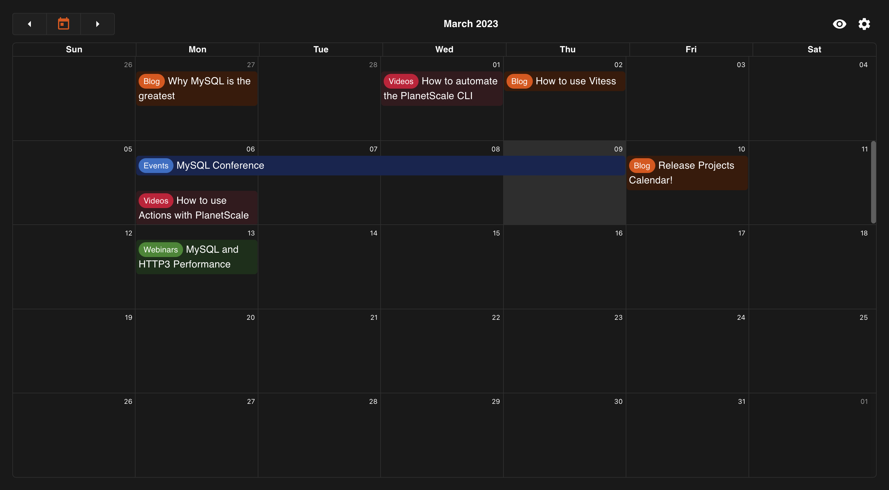
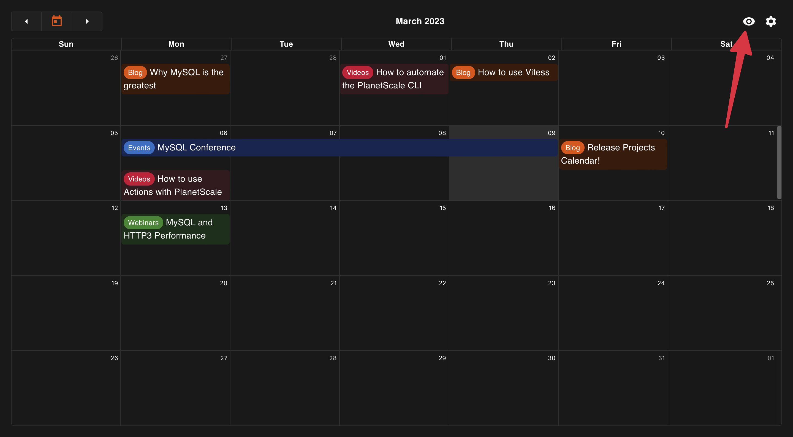
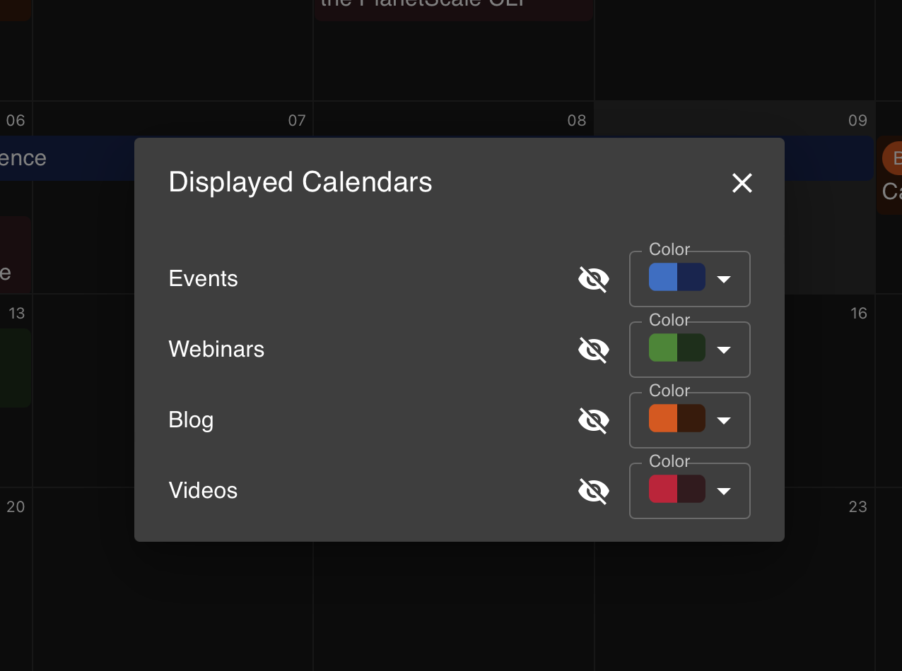
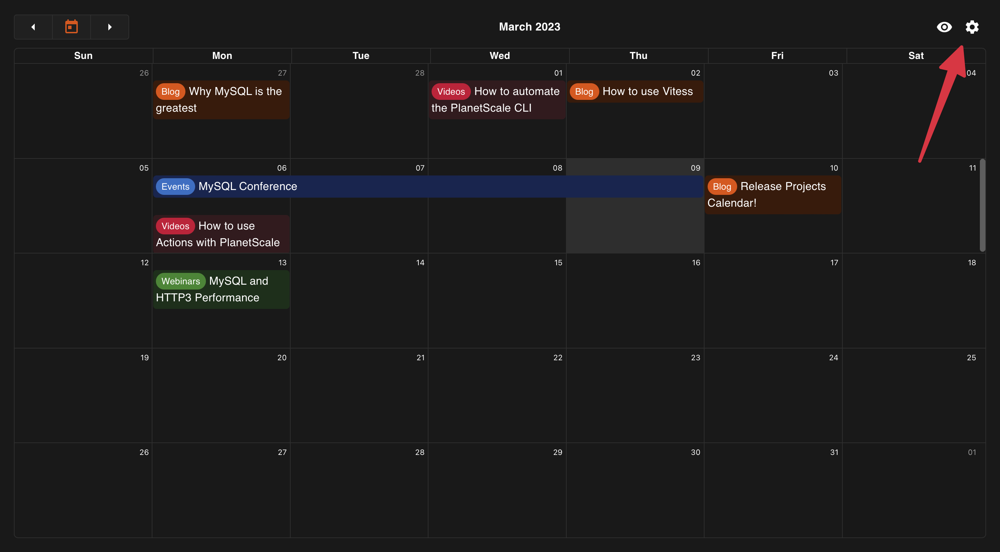
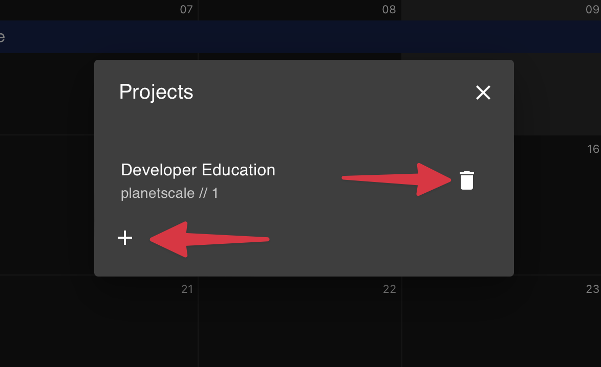
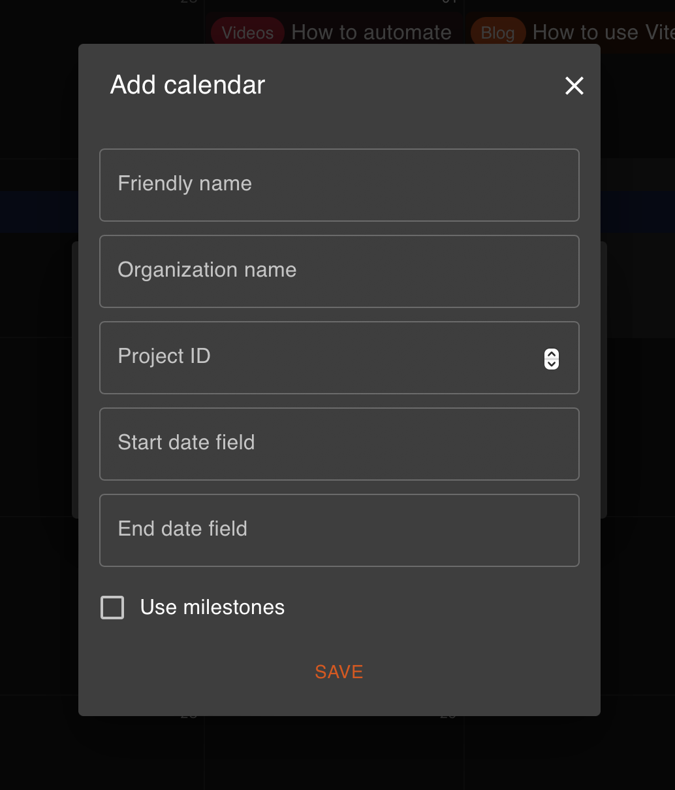
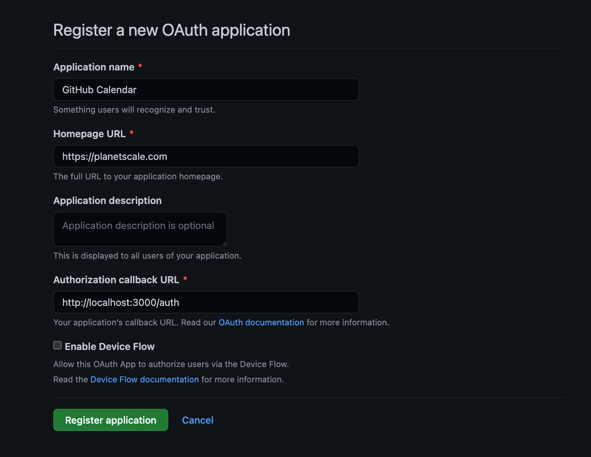
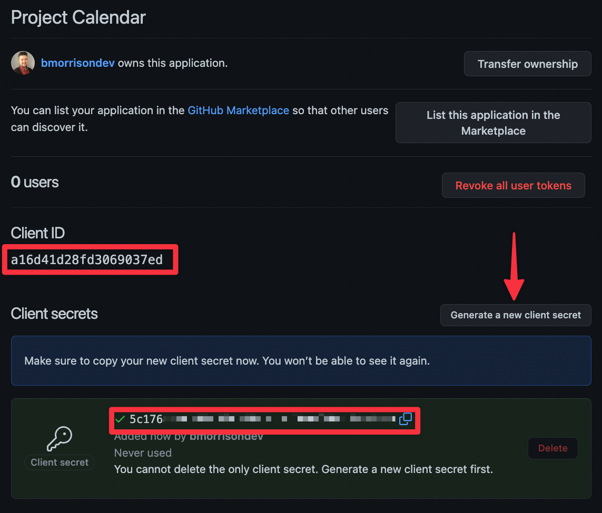
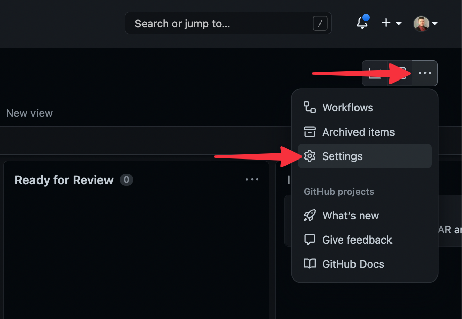
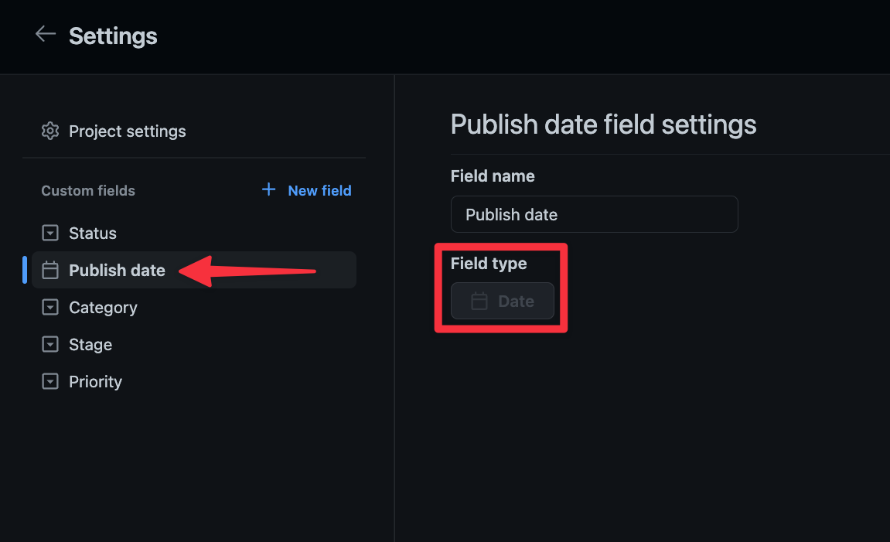

# GitHub Project Calendar

A tool designed to view GitHub project issues in a calendar view.

## Inspiration

PlanetScale has recently moved away from several siloed productivity tools to using GitHub projects exclusively. One of the pain points in this transition was viewing tasks on a proper calendar. This project aims to bridge that gap by utilizing the GitHub GraphQL API and [react-big-calendar](https://github.com/jquense/react-big-calendar) to display project issues in a visual way.

The project was initially built by the developer education team at PlanetScale to view upcoming blog posts and events planned by the marketing team. 

## How it works

The tool displays issues from one or more GitHub projects in a calendar-format. Clicking on any item on the calendar opens the linked issue in GitHub.



### Toggle project calendars

Each configured project calendar can be toggled on or off, depending on which calendars are important for you. To access to Displayed Calendars modal, click the eye icon in the upper right. 



The modal can then be used to toggle calendars as needed. When a calendar is toggled, the user preferences are saved to a PlanetScale database so they can be reflected on any device used.



### Configure project calendars

Existing projects can be viewed by clicking the **"cog icon"** in the upper right corner of the app.



Upon clicking the icon, you'll be presented with a modal displaying the configured projects. Clicking the **"trash icon"** will allow you to delete a project (note that this operation is permanent). Clicking the **"+ icon"** below the modal allows you to add a new project to the calendar.



The following form is used to add a project to the calendar:

- Friendly name -- Used for reference in the list of calendars.
- Organization name -- The name of the GitHub organization or user name.
- Project ID -- The project ID you want to add.
- Start date field -- The field to use for the start date range.
- End date field -- The field to use for the end date. For single day entries, re-use the Start date field.
- Use milestones -- If checked, the tool will break down the calendar entries by the Milestone in GitHub and allow you to toggle them by Milestone instead of Project name.



These entries are saved into a PlanetScale database for all users of your instance of the tool.

## Set up the project

This project is designed to be run on [Vercel](https://vercel.com/), although can be modified to work with any hosting provider. In order to use the project as is, you'll need to:

- Create a GitHub OAuth app
- Have a Vercel account for deployment
- A PlanetScale account for hosting the database

### Local development

Start by creating a [GitHub OAuth app](https://github.com/settings/applications/new) and populate the necessary fields. For local development, use "http://localhost:3000/auth" for the **"Authorization callback URL"**.



In the following view, click **"Generate a new client secret"**. Note **Client ID** and the generated **Client Secret** as you'll need them in the next step.



Next, open the project in your preferred IDE and rename `.env.sample` to `.env`. Populate the values as follows:

- REACT_APP_GH_REDIRECT_URI &mdash; `http://localhost:3000/auth`
- REACT_APP_GH_CLIENTID &mdash; The Client ID from the previous step
- GH_CLIENTSECRET &mdash; The Client Secret from the previous step

To configure the calendars displayed, open the Project which contains the issues you wish to display in GitHub. The URL is formatted as follows:

```
https://github.com/orgs/<ORG_NAME>/projects/<PROJECT_ID>
```

Note the values for `<ORG_NAME>` and `<PROJECT_ID>` for configuring the calendars. You'll also need to know the name of the fields for which you want to display start & end dates. To reference these, start in the project by clicking the **"..."** button in the upper right and then **"Settings"**.



The names of the fields available for the project will be listed on the left sidebar. The fields to display on the calendar MUST have the Date field type.



### Set up the database

The tool is setup to use a PlanetScale database to store the calendars to be displayed, as well as the users currently toggled calendars. Visit our documentation portal for guides on [how to create a database](https://planetscale.com/docs/onboarding/create-a-database) and [generating connection details](https://planetscale.com/docs/onboarding/connect-to-your-database) to connect to the database. When generating connection details, selecting `General` from the connection modal will provide the details reqiured to populate the `.env` file.


A script to set up the proper tables is located in `/db/init_db.sql`. You may enter each of the `CREATE TABLE` commands using the web console of your database, or by following our [guide on executing scripts using the PlanetScale CLI](https://planetscale.com/blog/run-sql-script-files-on-a-planetscale-database).

### Run the project

You may now run the project using the following command from your terminal.

```bash
npm start
```

If everything is setup properly, navigating to `http://localhost:3000` in your browser should prompt a login through GitHub.

## Deploy to Vercel

To deploy the project to Vercel, you will need to generate a new GitHub OAuth app since a single app does not support multiple redirect URIs. You'll need a domain to set up the GitHub app before you can create it. Perform the following steps in order to successfully deploy the tool:

1. Deploy to Vercel, capture the URL (referred to by `<VERCEL_URL>`)
2. Set up the new GitHub OAuth app using the steps described earlier in this readme. The redirect should be `<VERCEL_URL>/auth`
3. Navigate to the deployed site in Vercel and populate the following environment variables in Settings > Environment Variables:
    - **DATABASE_PASSWORD** -- The PlanetScale DB password.
    - **DATABASE_USERNAME** -- The PlanetScale DB password.
    - **DATABASE_HOST** -- The PlanetScale DB password.
    - **REACT_APP_GH_REDIRECT_URL** -- The redirect URI for the newly created GitHub OAuth app.
    - **REACT_APP_GH_CLIENTID** -- The client ID of the OAuth app.
    - **GH_CLIENTSECRET** -- The client secret of the OAuth app.

Once these details are populated, navigate to `<VERCEL_URL>` and you should be prompted to login via GitHub. 

> You may optionally choose to use a separate database branch for your local & deployed versions of the tool. To do this, create a separate branch and use those connection details in Vercel instead of the connection details taken from the local development section.

## How to contribute

To contribute to this project, fork the repository to your own GitHub account, and open a Pull Request with the changes you wish to apply.

## Support

This project is provided as-is with no support. To report bugs and request features, or to discover known bugs, please use the Issues tab.

